<p align="center">
  
</p>

# WattWeaveAI

> **AI-native compute–energy orchestration control plane.**
> Treats AI workloads, electricity, cooling, sovereignty, and (later) orbital capacity as one programmable resource fabric.

[](#testing)
[](#requirements)
[](#roadmap)
[](#designed-with-pgpgf)

WattWeaveAI implements the **EnerGrid AI Fabric** concept: an operating-system-style control plane that routes AI workloads across data centers, sovereign clouds, and edge zones based on **cost, carbon, latency, sovereignty, and chip availability** — all in one decision.

The MVP is fully terrestrial and runs on existing infrastructure abstractions. An `ExpansionSocket` is reserved for smart-city, sovereign-cloud, and orbital extensions so future capacity classes plug in without redesign.

---

## Why this exists

AI scaling is no longer limited only by model capability. It is limited by **where electricity is available, where cooling is possible, where chips can be deployed, and where regulation permits infrastructure expansion**.

WattWeaveAI is a candidate for the next major platform layer — not another model, but the **AI-native operating system for compute–energy allocation**.

```
┌──────────────────────────────────────────────────────────────────┐
│                       Workload Submission                        │
│                  (REST POST /v1/workloads · CLI)                 │
└──────────────────────────────┬───────────────────────────────────┘
                               ▼
       ┌───────────────────────────────────────────────────┐
       │             OrchestrationFacade                   │
       │   classify → tag → sense → decide → record        │
       └─┬───────────┬───────────┬───────────┬─────────────┘
         ▼           ▼           ▼           ▼
   Workload     Compliance    Grid +      Routing
   Classifier   Tagger        DC Sense    Decision
                                          (4-axis score)
                                              │
                                              ▼
                                   Append-only Audit (JSONL)
```

---

## Features

- **Multi-criteria routing** — composite score over `cost · carbon · latency · sovereignty` with carbon-priority tie-break.
- **Hard-constraint feasibility filter** — sovereign-class compatibility, chip availability, cooling headroom enforced before scoring.
- **Compliance metadata travels with the workload** — EU AI Act tier, data locality, carbon-reporting flag, audit retention all flow into the routing decision (not bolted on after).
- **Replayable audit trail** — every decision bundles its workload, tag, and the grid/DC snapshots it saw, written append-only as JSONL.
- **REST API + CLI** — same `OrchestrationFacade`, two interfaces.
- **Deterministic mock connectors** — `(region, hour)` → reproducible grid + DC telemetry, swapped for real adapters at deploy time.
- **AI_ stub functions** — three cognitive helpers (`AI_infer_sovereign_class`, `AI_estimate_energy_intensity`, `AI_explain_decision`) with rule-based bodies. Replace with an LLM later, callers don't change.
- **31 tests covering 26 acceptance criteria, 5 end-to-end scenarios, REST round-trip, performance budget, and audit immutability.**

---

## Designed with PG/PGF

This project was specified, reviewed, planned, executed, tested, verified, and reported in a **single full-cycle execution** of the [PG (PPR/Gantree Notation)](https://github.com/anthropics/claude-code) and PGF (PPR/Gantree Framework) skills.

All design artifacts live in `.pgf/`:

| File | Purpose |
|---|---|
| [`DESIGN-WattWeaveAI.md`](.pgf/DESIGN-WattWeaveAI.md) | Gantree (17 nodes) + PPR `def` blocks (14) + 26 `acceptance_criteria` |
| [`REVIEW-WattWeaveAI.md`](.pgf/REVIEW-WattWeaveAI.md) | 4-perspective design review (notation · security · architecture · feasibility) |
| [`WORKPLAN-WattWeaveAI.md`](.pgf/WORKPLAN-WattWeaveAI.md) | Topological execution order + POLICY block + file mapping |
| [`status-WattWeaveAI.json`](.pgf/status-WattWeaveAI.json) | Per-node execution state |
| [`VERIFY-WattWeaveAI.md`](.pgf/VERIFY-WattWeaveAI.md) | 3-perspective cross-verification (acceptance · quality · architecture) |
| [`REPORT-WattWeaveAI.md`](.pgf/REPORT-WattWeaveAI.md) | Full-cycle final report |
| `audit.jsonl` | Append-only decision log |

---

## Quick Start

### Requirements

- Python ≥ 3.10
- `pip install pytest fastapi httpx`

### Run the tests

```bash
git clone <this-repo> WattWeaveAI
cd WattWeaveAI
python -m pytest tests/ -v
# 31 passed in ~0.7s
```

### Use the CLI

```bash
# 1) Inspect the zone registry
PYTHONPATH=src python -m wattweave.control.cli zones

# 2) Submit a single workload
cat > request.json <<'EOF'
{
  "workload_id": "demo-1",
  "kind": "training",
  "latency_class": "batch",
  "sovereign_class": "eu",
  "estimated_kwh": 400.0,
  "estimated_minutes": 240,
  "chip_required": "gpu_h100",
  "description": "EU recommendation model fine-tune"
}
EOF
PYTHONPATH=src python -m wattweave.control.cli submit request.json

# 3) Replay the audit trail
PYTHONPATH=src python -m wattweave.control.cli audit demo-1
```

Expected routing for the EU training payload above: `nordic-colo-1` (eu-north). Carbon-priority tie-break beats the eu-west hyperscale region.

### Run the REST API

```bash
PYTHONPATH=src python -c "
import uvicorn
from wattweave.control.api import create_app
uvicorn.run(create_app(), host='0.0.0.0', port=8088)
"
```

```bash
curl http://localhost:8088/v1/health
curl http://localhost:8088/v1/zones
curl -X POST http://localhost:8088/v1/workloads \
     -H 'Content-Type: application/json' \
     -d @request.json
curl http://localhost:8088/v1/workloads/demo-1/audit
```

---

## API

### `POST /v1/workloads`

Submit a workload. Returns the routing decision and the audit record id.

**Request**

| Field | Type | Required | Notes |
|---|---|---|---|
| `workload_id` | string | yes | Unique id used for audit replay |
| `kind` | `"training" \| "inference" \| "fine_tuning" \| "batch_eval"` | no (default `"inference"`) | |
| `latency_class` | `"realtime" \| "interactive" \| "batch" \| "deferred"` | no (default `"batch"`) | |
| `sovereign_class` | `"none" \| "eu" \| "us" \| "kr" \| "jp" \| "regulated_health"` | no | If omitted, inferred from `description` |
| `estimated_kwh` | float ≥ 0 | yes | |
| `estimated_minutes` | int ≥ 0 | yes | |
| `chip_required` | `"gpu_h100" \| "gpu_a100" \| "gpu_l4" \| "cpu" \| "any"` | no (default `"any"`) | |
| `description` | string | no | Used by AI_ stubs when explicit fields are missing |

**Response 200**

```json
{
  "audit_record_id": "431e141c2b8f4304bce4dfe9a5acb23f",
  "decision": {
    "workload_id": "demo-1",
    "chosen_zone_id": "nordic-colo-1",
    "score_breakdown": {"cost": 0.96, "carbon": 0.96, "latency": 0.95, "sovereign": 1.00, "composite": 0.96},
    "candidates_considered": ["nordic-colo-1", "eu-west-hyper-1"],
    "reason": "Workload demo-1 (training/batch) routed to zone nordic-colo-1 ...",
    "decided_at": "2026-05-10T13:00:00+00:00",
    "blocked_reason": null
  }
}
```

When no zone is feasible, `chosen_zone_id` is `null` and `blocked_reason` carries the cause (e.g., `"no_feasible_zone"`, `"missing_telemetry"`).

### `GET /v1/zones`

Returns the active zone registry.

### `GET /v1/workloads/{id}/audit`

Returns all audit records for a workload id (each bundles workload, decision, compliance tag, and snapshots seen at decision time).

### `GET /v1/health`

Liveness probe.

---

## Project Layout

```
WattWeaveAI/
├── .pgf/                              # PG/PGF design artifacts (canonical project memory)
│   ├── DESIGN-WattWeaveAI.md          # Gantree + PPR specification
│   ├── REVIEW-WattWeaveAI.md          # 4-perspective design review
│   ├── WORKPLAN-WattWeaveAI.md        # Topological execution plan
│   ├── status-WattWeaveAI.json        # Per-node state
│   ├── VERIFY-WattWeaveAI.md          # Cross-verification
│   ├── REPORT-WattWeaveAI.md          # Final report
│   └── audit.jsonl                    # Append-only decision log
├── config/
│   └── zones.json                     # Seed zone registry (6 zones)
├── docs/
│   ├── system_design.md               # Source: 8-agent ideation (excerpt)
│   ├── final_idea.md                  # Source: 8-agent final idea selection
│   └── 통합보고서.md                   # Source: integration report (Korean)
├── src/wattweave/
│   ├── types.py                       # Foundation/DomainTypes
│   ├── config.py                      # Foundation/ConfigLoader
│   ├── sensing/
│   │   ├── workload_classifier.py     # Classify request → Workload
│   │   ├── grid_telemetry.py          # Mock grid connector (deterministic)
│   │   └── dc_telemetry.py            # Mock DC connector (deterministic)
│   ├── decision/
│   │   ├── zone_registry.py           # Load + index zones
│   │   ├── feasibility.py             # Hard-constraint filter
│   │   ├── scorer.py                  # 4-axis multi-criteria scorer
│   │   └── scheduler.py               # Routing decision + AI_explain
│   ├── compliance/
│   │   ├── tagger.py                  # ComplianceTag (regulation as input)
│   │   └── audit.py                   # Append-only JSONL log
│   └── control/
│       ├── facade.py                  # OrchestrationFacade — single entry
│       ├── api.py                     # FastAPI surface
│       └── cli.py                     # argparse CLI
└── tests/
    ├── test_units.py                  # 24 unit tests
    ├── test_scenarios.py              # 5 end-to-end scenarios
    └── test_acceptance.py             # 5 acceptance + REST round-trip + perf
```

---

## How Decisions Get Made

### 1. Feasibility (hard constraints, deterministic)

A zone is **feasible** for a workload only if:

- `sovereign_class` is compatible (workload class matches zone class, or workload class is `"none"`)
- the requested chip is available in the latest DC snapshot (`chip_available[chip_required] ≥ 1`)
- `cooling_utilization < 0.95`

Workloads with `sovereign_class="regulated_health"` only run on zones explicitly marked as `regulated_health`-cleared.

### 2. Multi-criteria scoring (continuous, deterministic)

Every feasible zone gets four sub-scores in `[0, 1]` (1 = better):

| Axis | Source | Notes |
|---|---|---|
| `cost` | `grid.power_price_usd_mwh` | Linearly normalized over `[20, 250] USD/MWh` |
| `carbon` | `grid.carbon_intensity_g_kwh` vs `zone.max_carbon_intensity` | Hard penalty when zone cap exceeded |
| `latency` | `(workload.latency_class, zone.zone_type)` lookup | `realtime` favors `edge`/`smart_city`, `batch` favors `hyperscale` |
| `sovereign` | exact class match | Mismatch with explicit class = 0 |

Composite = weighted sum (default weights 0.25 cost / 0.30 carbon / 0.25 latency / 0.20 sovereign, summing to 1).

### 3. Tie-break: **carbon first, then cost**

Two zones with equal composite scores → the one with the higher carbon score wins. This makes the system **carbon-aware by construction** — not an opt-in policy.

### 4. Audit (replayable)

Every decision is paired with the **grid and DC snapshots that produced it**. Replaying an audit record reconstructs the full input context.

---

## The Six Seed Zones

| Zone | Region | Type | Sovereign | Notes |
|---|---|---|---|---|
| `us-east-hyper-1` | us-east | hyperscale | us | Big chip inventory |
| `eu-west-hyper-1` | eu-west | hyperscale | eu | EU primary |
| `kr-central-sov-1` | kr-central | sovereign_cloud | kr | KR-resident workloads |
| `nordic-colo-1` | eu-north | colocation | eu | **Lowest-carbon EU zone** |
| `tokyo-edge-1` | jp-east | edge | jp | Realtime-friendly, no h100 |
| `smartcity-seoul-1` | kr-central | smart_city | kr | Realtime-friendly, no h100 |

Edit [`config/zones.json`](config/zones.json) to add or modify zones — no code changes required.

---

## Roadmap

```
v0.1  (this release)     ✅  Terrestrial control plane MVP
v0.2  (planned 2026 Q3)  ▢   PQC-signed audit (ML-DSA)
                         ▢   Real OpenADR grid adapter
                         ▢   Real Kubernetes/BMS DC adapter
v0.3  (planned 2027)     ▢   SmartCityHook (microgrid producer/consumer)
                         ▢   ComputeEnergyMarket (capacity bids, carbon arbitrage)
v1.0  (planned 2028+)    ▢   OrbitalHook — LEO + space-based-solar as another zone class
```

Each milestone activates one child of the `ExpansionSocket` Gantree node defined in v0.1 — slot interfaces are already in place.

---

## Testing

```bash
python -m pytest tests/ -v
```

Output:

```
tests/test_units.py        24 passed
tests/test_scenarios.py     5 passed   (carbon-aware · sovereign · realtime · blocked · audit replay)
tests/test_acceptance.py    5 passed   (weights · 5-layer · <50ms budget · append-only · REST)
============================ 31 passed in 0.51s ============================
```

The five end-to-end scenarios encode the strengths and risks called out in the source ideation documents:

| Scenario | What it proves |
|---|---|
| A · Carbon-aware routing | EU training run picks `nordic-colo-1` (eu-north) over `eu-west-hyper-1` purely on grid carbon |
| B · Sovereign isolation | EU workload never lands on a US zone, even when the US zone has better grid signals |
| C · Realtime protection | `latency_class="realtime"` forces an `edge` / `smart_city` zone — never bare hyperscale |
| D · Blocked on infeasibility | JP h100 training is blocked because no JP zone stocks h100, with explicit `blocked_reason` |
| E · Audit replay | Two submits with the same clock yield identical decisions and identical audit reconstructions |

---

## Documents That Inspired the System

The MVP is the engineering instantiation of an 8-agent ideation cycle whose artifacts live in `docs/`:

- [`docs/system_design.md`](docs/system_design.md) — original EnerGrid concept (Insight / Hypothesis / Creation / Scenario layers)
- [`docs/final_idea.md`](docs/final_idea.md) — eight independent agents evaluating 24 candidate ideas; **5/8 selected EnerGrid AI Fabric**
- [`docs/통합보고서.md`](docs/통합보고서.md) — Korean integration report consolidating the agent decisions

Read those if you want the *why* behind the architecture; read [`.pgf/DESIGN-WattWeaveAI.md`](.pgf/DESIGN-WattWeaveAI.md) if you want the *how*.

---

## Contributing

This is a reference implementation for the EnerGrid AI Fabric concept. The PG/PGF cycle that produced it is in `.pgf/` — every architectural decision has a traceable design line, an `acceptance_criteria` entry, and a passing test.

When proposing changes:

1. Update [`DESIGN-WattWeaveAI.md`](.pgf/DESIGN-WattWeaveAI.md) (Gantree node + PPR + acceptance_criteria).
2. Add or extend tests under `tests/` so the criterion is auto-checked.
3. Run `python -m pytest tests/ -v` — all 31+ tests must pass.
4. Append a verify entry to [`VERIFY-WattWeaveAI.md`](.pgf/VERIFY-WattWeaveAI.md).

---

## License

See [`LICENSE`](LICENSE).

---

## Acknowledgements

- The original EnerGrid AI Fabric concept emerged from a multi-agent ideation cycle preserved in `docs/`.
- Designed and implemented in a single PG/PGF v2.5 full-cycle execution.
- Generated under the Claude Code runtime.
